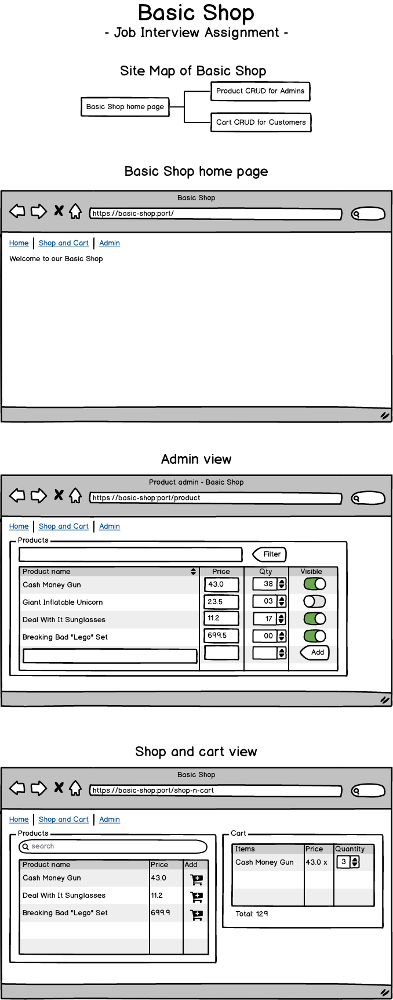
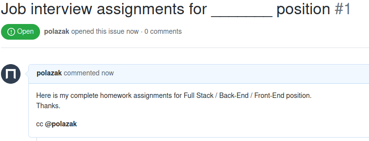

# Job Interview Assignments for Full Stack, Back-End and Front-End Developer position

## Introduction
The task is to create a Basic Shop web application with 3 pages: Welcome, Product [CRUD][CRUD] and Shopping Cart CRUD.

We have only one task, but with options for Full Stack, Back-End and Front-End.
A Front-End developer may use localStorage and focus on the user interface, meanwhile a Back-End developer may can be 
done with RESTful-API endpoint only. Naturally a Full Stack folk should be able to progress on both side.

The reason why We combined the task for all stack is because the feature request usually does not care about the 
affinity of the developers, but the comprehensive product.

We highly recommend following the [MVP][MVP] mindset and push your prototype as soon as it  has any working function.

Are you ready?

## Mockup
The following mockup can give you a hint, what todo.

## The Task
Build a Basic Shop web application with 3 pages.
 - **Basic Shop home page** is a static welcome page with links to the admin and customer pages.
 - **Admin view** is a CRUD interface where admins (or anyone who click on that link) can creat, list, modify products.
 - **Shop and cart view** is a CRUD interface for Shopping Cart plus it lists only visible products.

### Back-End must have
 - Clear project structure and readable code style in any - yes any - of the following languages:
   - PHP
   - Python
   - Golang
   - NodeJS
 - Build a working web application or API with swagger
 - Endpoints to manage products
 - Endpoints to manage cart
 - A README.md telling how it works.
 - Make script to run.

### Back-End should have
 - Provide database migration
 - Usages of Docker
 - Demonstration of TDD practices
 - Comment or Documentation in clear English for Front-End developer as [SLA][SLA]

### Front-End must have
 - Build a Single-page Application website using React Redux
 - Back-End can be mocked using [Json-Server][Json-Server]
 - A view to manage products.
 - A view to manage the cart.
 - A README.md telling how it works.

### Front-End should have
 - View separation with Router
 - Good demonstration of state management
 - Clear project structure and readable code style
 - Demonstration usage of Babel and LESS/SASS/SCSS
 - Clear demonstration of stateless and stateful components
 - Comment or Documentation in clear English for Back-End developer as [SLA][SLA]

### Full Stack must have
 - Build a RESTful-API
 - Build a Single-page Application website using React Redux and the Back-End endpoint.

## Submit the assignment
Once you've completed, push your commitment to Github. Because your submissions occur on Github follow a particular 
format which includes a clearly documented README.

Finally raise an issue as detailed below.

Submit your project by creating an issue on your repository and adding the Github handle (@polazak) to the issue body,
so we can review the submission.

However, be sure to include a README.md telling how it works.

## Please contact us if you have any question.
hr@polazak.com

[MVP]:<https://en.wikipedia.org/wiki/Minimum_viable_product>
[SLA]:<https://en.wikipedia.org/wiki/Service-level_agreement>
[CRUD]:<https://en.wikipedia.org/wiki/Create,_read,_update_and_delete>
[Json-Server]:<https://github.com/typicode/json-server>

